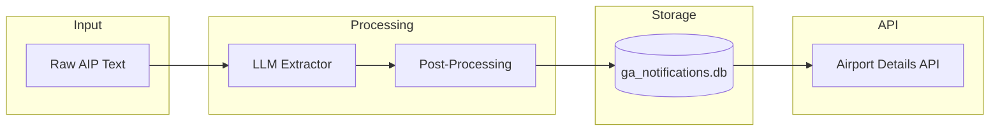

# NOTIFICATION DATA PARSING DESIGN

## Goal

Convert free-text customs/immigration notification data from `aip_entries` into structured, queryable data using LLM-based extraction.

## Data Source

- **Table**: `aip_entries` in `airports.db`
- **Field**: `std_field_id = 302` (Customs and immigration)
- **Count**: 602 entries across Europe

## Architecture



## Implementation

### Files

| File | Description |
|------|-------------|
| `shared/ga_notification_agent/llm_extractor.py` | LLM-based extraction using OpenAI-compatible API |
| `shared/ga_notification_agent/batch_processor.py` | Batch processing for all airports |
| `web/server/notification_service.py` | Service to lookup parsed notifications |
| `web/server/api/airports.py` | API endpoint integration |
| `web/server/ga_notifications.db` | SQLite database with parsed results |

### Environment Variables

| Variable | Description |
|----------|-------------|
| `LLM_API_BASE` | API endpoint (OpenAI-compatible) |
| `LLM_MODEL` | Model name |
| `LLM_API_KEY` | API authentication key |

### LLM Extractor

```python
class LLMNotificationExtractor:
    """Extract notification requirements using LLM."""
    
    def __init__(self, api_key=None, api_base=None, model=None):
        self.api_base = api_base or os.environ.get("LLM_API_BASE")
        self.model = model or os.environ.get("LLM_MODEL")
        self.api_key = api_key or os.environ.get("LLM_API_KEY")
    
    def extract(self, icao: str, text: str) -> ExtractedNotification:
        # Returns structured notification data
```

### Database Schema

| Column | Type | Description |
|--------|------|-------------|
| icao | TEXT | Airport ICAO code |
| rule_type | TEXT | `customs` or `immigration` |
| notification_type | TEXT | `hours`, `h24`, `on_request`, `business_day` |
| hours_notice | INTEGER | Max hours required (24, 48, etc.) |
| operating_hours_start | TEXT | Opening time (HHMM) |
| operating_hours_end | TEXT | Closing time (HHMM) |
| weekday_rules | JSON | Day-specific rules |
| schengen_rules | JSON | Schengen/non-Schengen conditions |
| contact_info | JSON | Phone and email |
| summary | TEXT | Formatted UI summary |
| raw_text | TEXT | Original AIP text |
| confidence | REAL | Extraction confidence (0-1) |
| llm_response | TEXT | Full LLM response for debugging |

### UI Summary Format

```
Mon-Fri: 24h notice | Sat-Sun/HOL: 48h notice
Non-Schengen only | Hours: 07:00-19:00
📞 09 70 27 51 53
📧 example@customs.gov
```

## API Integration

The parsed notification replaces the raw text in the airport details API response:

```json
{
  "std_field": "Customs and immigration",
  "std_field_id": 302,
  "value": "Mon-Fri: 24h notice | Sat-Sun/HOL: 48h notice\n📞 09 70 27 51 53",
  "parsed_notification": true,
  "notification_confidence": 0.99
}
```

Post-processing removes empty lines (e.g., "Hours:" without value).

## Results

### French Airports (LF*)

| Metric | Value |
|--------|-------|
| Total processed | 116 |
| Successful | 112 (96.6%) |
| Failed | 4 (3.4%) |
| Average confidence | 0.96 |

### Notification Types

| Type | Count |
|------|-------|
| hours | 37 |
| h24 | 26 |
| on_request | 22 |
| business_day | 17 |
| NIL/unavailable | 14 |

## Future Work

1. Process remaining European airports (486 entries)
2. Add regex validation layer
3. Implement query API for filtering by notice requirements
4. Add hassle score calculation
